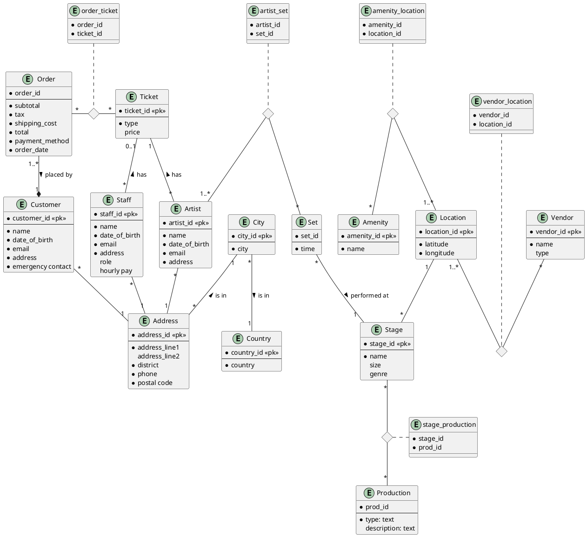

### Logical Diagram

```plantuml
@startuml

entity Ticket {
    * ticket_id <<pk>>
    --
    * type
    price
}

entity Order {
    * order_id
    --
    * subtotal
    * tax
    * shipping_cost
    * total
    * payment_method
    * order_date
}

entity Customer {
    * customer_id <<pk>>
    --
    * name
    * date_of_birth
    * email
    * address
    * emergency contact
}

entity Artist {
    * artist_id <<pk>>
    --
    * name
    * date_of_birth
    * email
    * address
}

entity Staff {
    * staff_id <<pk>>
    --
    * name
    * date_of_birth
    * email
    * address
    role
    hourly pay
}

entity Stage {
    * stage_id <<pk>>
    --
    * name
    size
    genre
}

entity Vendor {
    * vendor_id <<pk>>
    --
    * name
    type
}

entity Address {
    * address_id <<pk>>
    --
    * address_line1
    address_line2
    * district
    * phone
    * postal code
}

entity Country {
    * country_id <<pk>>
    --
    * country
}

entity City {
    * city_id <<pk>>
    --
    * city
}

entity Location {
    * location_id <<pk>>
    --
    * latitude
    * longitude
}

entity Amenity {
    * amenity_id <<pk>>
    --
    * name
}

entity Set {
    * set_id
    --
    * time
}

entity Production {
    * prod_id
    --
    * type: text
    description: text
}

entity stage_production {
    * stage_id
    * prod_id
}

entity artist_set {
    * artist_id
    * set_id
}

entity order_ticket {
    * order_id
    * ticket_id
}

entity amenity_location {
    * amenity_id
    * location_id
}
entity vendor_location {
    * vendor_id
    * location_id
}

<> artist_set_diamond
<> vendor_location_diamond
<> amenity_location_diamond
<> order_ticket_diamond
<> stage_production_diamond

Order "*" - order_ticket_diamond
order_ticket_diamond - "*" Ticket
Order "1..*" --* "1" Customer: placed by >
Ticket "1" -- "*" Artist: has <
Ticket "0..1" -- "*" Staff: has <
Location "1  " -- "*" Stage
Stage "*" -- stage_production_diamond
stage_production_diamond -- "*" Production
stage_production_diamond . stage_production
Artist "*" -- "1" Address
Staff "*" -- "1" Address
Customer "*" -- "1" Address
City "1" -- "*" Address: is in <
City "*" -- "1" Country: is in >
Set "*" -- "1  " Stage: performed at >
artist_set_diamond -- "1..*" Artist
artist_set_diamond -- "*" Set
Vendor "*" -- vendor_location_diamond
Location "1..*" -- vendor_location_diamond
amenity_location_diamond -- "     *" Amenity
amenity_location_diamond -- "1..*" Location
artist_set .. artist_set_diamond
order_ticket .. order_ticket_diamond
amenity_location .. amenity_location_diamond
vendor_location ... vendor_location_diamond

@enduml
```