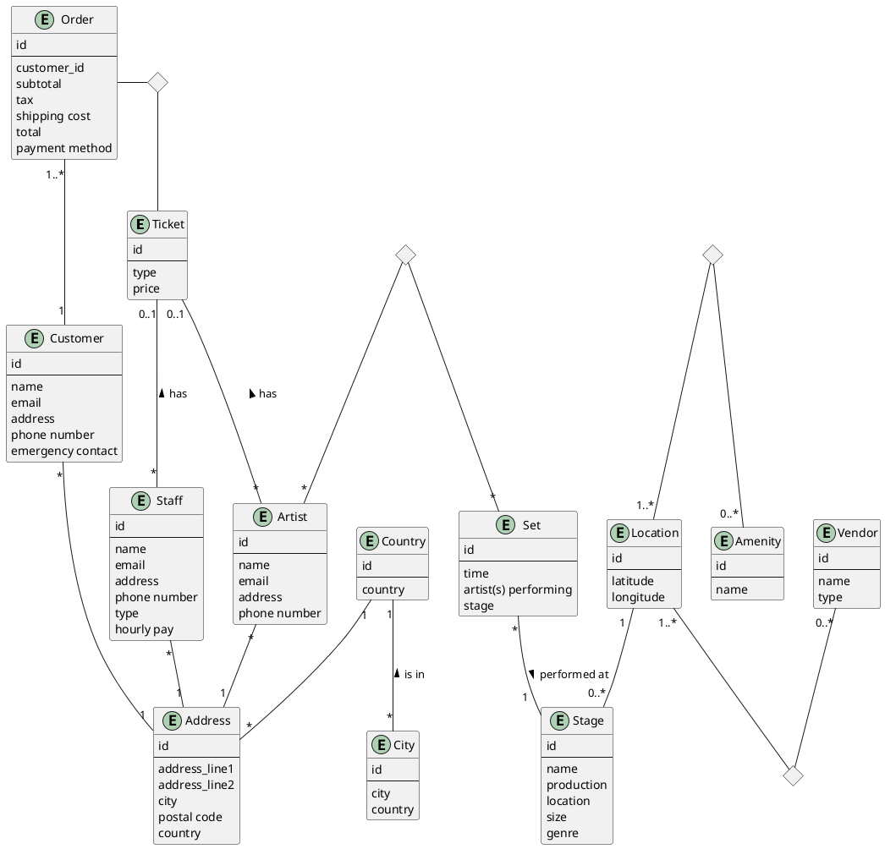

### Logical Diagram

```plantuml
@startuml

entity Ticket {
    id
    --
    type
    price
}

entity Order {
    id
    --
    customer_id
    subtotal
    tax
    shipping cost
    total
    payment method
}

entity Customer {
    id
    --
    name
    email
    address
    phone number
    emergency contact
}

entity Artist {
    id
    --
    name
    email
    address
    phone number
}

entity Staff {
    id
    --
    name
    email
    address
    phone number
    type
    hourly pay
}

entity Stage {
    id
    --
    name
    production
    location
    size
    genre
}

entity Vendor {
    id
    --
    name
    type
}

entity Address {
    id
    --
    address_line1
    address_line2
    city
    postal code
    country
}

entity Country {
    id
    --
    country
}

entity City {
    id
    --
    city
    country
}

entity Location {
    id
    --
    latitude
    longitude
}

entity Amenity {
    id
    --
    name
}

entity Set {
    id
    --
    time
    artist(s) performing
    stage
}

<> artist_set_diamond
<> vendor_location_diamond
<> amenity_location_diamond
<> order_ticket_diamond

Order - order_ticket_diamond
order_ticket_diamond -- Ticket
Order "1..*" -- "1" Customer
'Order -- "*" Ticket
'Ticket "1..*" -- "1" Customer: buys <
Ticket "0..1" -- "*" Artist: has <
Ticket "0..1" -- "*" Staff: has <
'Stage "1..*" -- "1..*" Artist: performs at <
Location "1  " -- "0..*" Stage
'Location "1..*" -- "0..*" Vendor
'Location "1..*" -- "0..*" Amenity
Artist "*" -- "1" Address
Staff "*" -- "1" Address
Customer "*" -- "1" Address
Country "1" -- "*" Address
Country "1" -- "*" City: is in <
Set "*" -- "1  " Stage: performed at >
'Set "*" -- "*" Artist
artist_set_diamond -- "*" Artist
artist_set_diamond -- "*" Set
Vendor "0..*" -- vendor_location_diamond
Location "  1..*" -- vendor_location_diamond
amenity_location_diamond -- "0..* " Amenity
amenity_location_diamond -- "1..*" Location

@enduml
```