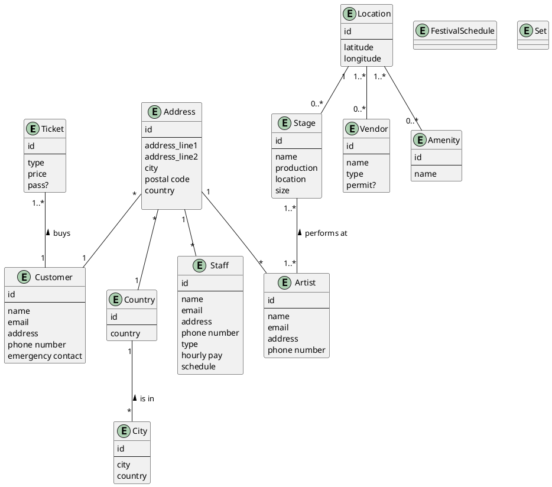

### Logical Diagram

```plantuml
@startuml

entity Ticket {
    id
    --
    type
    price
    pass?
}

entity Customer {
    id
    --
    name
    email
    address
    phone number
    emergency contact
}

entity Artist {
    id
    --
    name
    email
    address
    phone number
}

entity Staff {
    id
    --
    name
    email
    address
    phone number
    type
    hourly pay
    schedule
}

entity Stage {
    id
    --
    name
    production
    location
    size
}

entity Vendor {
    id
    --
    name
    type
    permit?
}

entity Address {
    id
    --
    address_line1
    address_line2
    city
    postal code
    country
    
}

entity Country {
    id
    --
    country
}

entity City {
    id
    --
    city
    country
}

entity Location {
    id
    --
    latitude
    longitude
}

entity Amenity {
    id
    --
    name
}

entity FestivalSchedule {
    
}

entity Set {
    
}

Ticket "1..*" -- "1" Customer: buys <
Stage "1..*" -- "1..*" Artist: performs at <
Location "1" -- "0..*" Stage
Location "1..*" -- "0..*" Vendor
Location "1..*" -- "0..*" Amenity
Address "1" -- "*" Artist
Address "1" -- "*" Staff
Address "*" -- "1" Customer
Address "*" -- "1" Country
Country "1" -- "*" City: is in <

@enduml
```