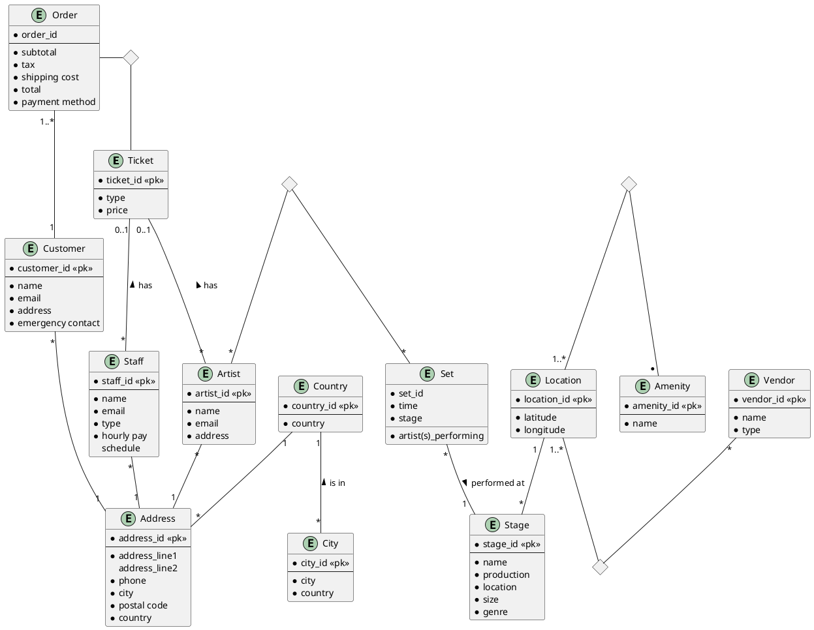

### Logical Diagram

```plantuml
@startuml

entity Ticket {
    * ticket_id <<pk>>
    --
    * type
    * price
}

entity Order {
    * order_id
    --
    * subtotal
    * tax
    * shipping cost
    * total
    * payment method
}

entity Customer {
    * customer_id <<pk>>
    --
    * name
    * email
    * address
    * emergency contact
}

entity Artist {
    * artist_id <<pk>>
    --
    * name
    * email
    * address
}

entity Staff {
    * staff_id <<pk>>
    --
    * name
    * email
    * type
    * hourly pay
    schedule
}

entity Stage {
    * stage_id <<pk>>
    --
    * name
    * production
    * location
    * size
    * genre
}

entity Vendor {
    * vendor_id <<pk>>
    --
    * name
    * type
}

entity Address {
    * address_id <<pk>>
    --
    * address_line1
    address_line2
    * phone
    * city
    * postal code
    * country
}

entity Country {
    * country_id <<pk>>
    --
    * country
}

entity City {
    * city_id <<pk>>
    --
    * city
    * country
}

entity Location {
    * location_id <<pk>>
    --
    * latitude
    * longitude
}

entity Amenity {
    * amenity_id <<pk>>
    --
    * name
}

entity Set {
    * set_id
    * time
    * artist(s)_performing
    * stage
}

<> artist_set_diamond
<> vendor_location_diamond
<> amenity_location_diamond
<> order_ticket_diamond

Order - order_ticket_diamond
order_ticket_diamond -- Ticket
Order "1..*" -- "1" Customer
'Order -- "*" Ticket
'Ticket "1..*" -- "1" Customer: buys <
Ticket "0..1" -- "*" Artist: has <
Ticket "0..1" -- "*" Staff: has <
'Stage "1..*" -- "1..*" Artist: performs at <
Location "1  " -- "*" Stage
'Location "1..*" -- "*" Vendor
'Location "1..*" -- "*" Amenity
Artist "*" -- "1" Address
Staff "*" -- "1" Address
Customer "*" -- "1" Address
Country "1" -- "*" Address
Country "1" -- "*" City: is in <
Set "*" -- "1  " Stage: performed at >
'Set "*" -- "*" Artist
artist_set_diamond -- "*" Artist
artist_set_diamond -- "*" Set
Vendor "*" -- vendor_location_diamond
Location "  1..*" -- vendor_location_diamond
amenity_location_diamond -- "* " Amenity
amenity_location_diamond -- "1..*" Location

@enduml
```