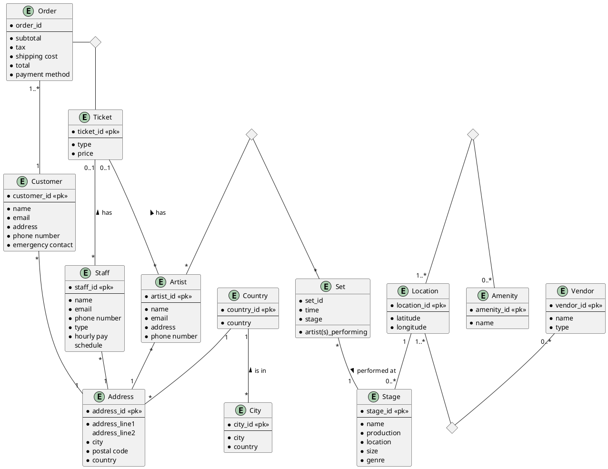
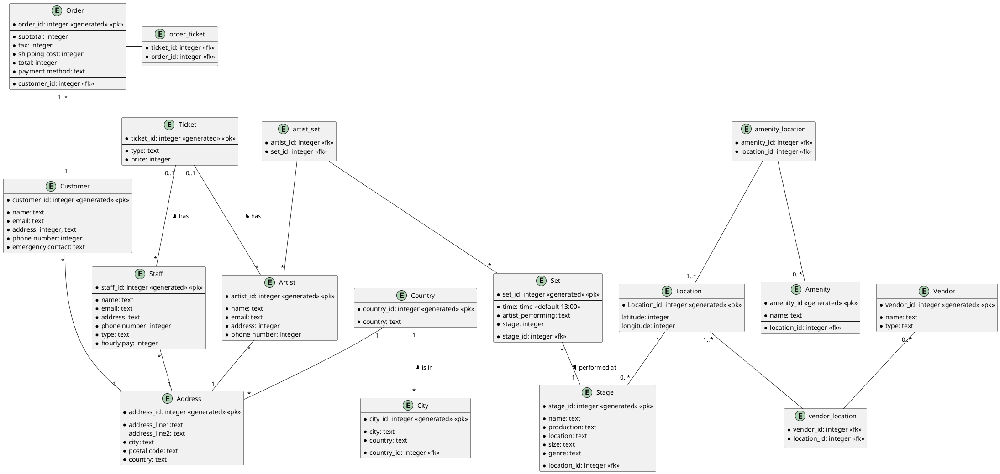

```plantuml

@startuml

entity Ticket {
    * ticket_id <<pk>>
    --
    * type
    * price
}

entity Order {
    * order_id
    --
    * subtotal
    * tax
    * shipping cost
    * total
    * payment method
}

entity Customer {
    * customer_id <<pk>>
    --
    * name
    * email
    * address
    * phone number
    * emergency contact
}

entity Artist {
    * artist_id <<pk>>
    --
    * name
    * email
    * address
    * phone number
}

entity Staff {
    * staff_id <<pk>>
    --
    * name
    * email
    * phone number
    * type
    * hourly pay
    schedule
}

entity Stage {
    * stage_id <<pk>>
    --
    * name
    * production
    * location
    * size
    * genre
}

entity Vendor {
    * vendor_id <<pk>>
    --
    * name
    * type
}

entity Address {
    * address_id <<pk>>
    --
    * address_line1
    address_line2
    * city
    * postal code
    * country
}

entity Country {
    * country_id <<pk>>
    --
    * country
}

entity City {
    * city_id <<pk>>
    --
    * city
    * country
}

entity Location {
    * location_id <<pk>>
    --
    * latitude
    * longitude
}

entity Amenity {
    * amenity_id <<pk>>
    --
    * name
}

entity Set {
    * set_id
    * time
    * artist(s)_performing
    * stage
}

<> artist_set_diamond
<> vendor_location_diamond
<> amenity_location_diamond
<> order_ticket_diamond

Order - order_ticket_diamond
order_ticket_diamond -- Ticket
Order "1..*" -- "1" Customer
'Order -- "*" Ticket
'Ticket "1..*" -- "1" Customer: buys <
Ticket "0..1" -- "*" Artist: has <
Ticket "0..1" -- "*" Staff: has <
'Stage "1..*" -- "1..*" Artist: performs at <
Location "1  " -- "0..*" Stage
'Location "1..*" -- "0..*" Vendor
'Location "1..*" -- "0..*" Amenity
Artist "*" -- "1" Address
Staff "*" -- "1" Address
Customer "*" -- "1" Address
Country "1" -- "*" Address
Country "1" -- "*" City: is in <
Set "*" -- "1  " Stage: performed at >
'Set "*" -- "*" Artist
artist_set_diamond -- "*" Artist
artist_set_diamond -- "*" Set
Vendor "0..*" -- vendor_location_diamond
Location "  1..*" -- vendor_location_diamond
amenity_location_diamond -- "0..* " Amenity
amenity_location_diamond -- "1..*" Location

@enduml
```

```plantuml
@startuml

entity Ticket {
    * ticket_id: integer <<generated>> <<pk>>
    --
    * type: text
    * price: integer
}

entity Order {
    * order_id: integer <<generated>> <<pk>>
    --
    * subtotal: integer 
    * tax: integer
    * shipping cost: integer
    * total: integer
    * payment method: text
    --
    * customer_id: integer <<fk>>
}


entity Customer {
    * customer_id: integer <<generated>> <<pk>>
    --
    * name: text
    * email: text
    * address: integer, text
    * phone number: integer
    * emergency contact: text
}

entity Artist {
    * artist_id: integer <<generated>> <<pk>>
    --
    * name: text
    * email: text
    * address: integer
    * phone number: integer
}

entity Staff {
    * staff_id: integer <<generated>> <<pk>>
    --
    * name: text
    * email: text
    * address: text
    * phone number: integer
    * type: text
    * hourly pay: integer
}

entity Stage {
    * stage_id: integer <<generated>> <<pk>>
    --
    * name: text
    * production: text
    * location: text
    * size: text
    * genre: text
    --
    * location_id: integer <<fk>>
}

entity Vendor {
    * vendor_id: integer <<generated>> <<pk>>
    --
    * name: text
    * type: text
}

entity Address {
    * address_id: integer <<generated>> <<pk>>
    --
    * address_line1:text
    address_line2: text
    * city: text
    * postal code: text
    * country: text
}

entity Country {
    * country_id: integer <<generated>> <<pk>>
    --
    * country: text
}

entity City {
    * city_id: integer <<generated>> <<pk>>
    --
    * city: text
    * country: text
    --
    * country_id: integer <<fk>>
}

entity Location {
    * Location_id: integer <<generated>> <<pk>>
    --
    latitude: integer
    longitude: integer
}

entity Amenity {
    * amenity_id <<generated>> <<pk>>
    --
    * name: text
    --
    * location_id: integer <<fk>>
}

entity Set {
    * set_id: integer <<generated>> <<pk>>
    --
    * time: time <<default 13:00>>
    * artist_performing: text
    * stage: integer
    --
    * stage_id: integer <<fk>>
}

entity order_ticket {
    * ticket_id: integer <<fk>>
    * order_id: integer <<fk>>
}

entity artist_set {
    * artist_id: integer <<fk>>
    * set_id: integer <<fk>>
}

entity amenity_location {
    * amenity_id: integer <<fk>>
    * location_id: integer <<fk>>
}

entity vendor_location {
    * vendor_id: integer <<fk>>
    * location_id: integer <<fk>>
}

Order - order_ticket
order_ticket -- Ticket
Order "1..*" -- "1" Customer
'Order -- "*" Ticket
'Ticket "1..*" -- "1" Customer: buys <
Ticket "0..1" -- "*" Artist: has <
Ticket "0..1" -- "*" Staff: has <
'Stage "1..*" -- "1..*" Artist: performs at <
Location "1  " -- "0..*" Stage
'Location "1..*" -- "0..*" Vendor
'Location "1..*" -- "0..*" Amenity
Artist "*" -- "1" Address
Staff "*" -- "1" Address
Customer "*" -- "1" Address
Country "1" -- "*" Address
Country "1" -- "*" City: is in <
Set "*" -- "1  " Stage: performed at >
'Set "*" -- "*" Artist
artist_set -- "*" Artist
artist_set -- "*" Set
Vendor "0..*" -- vendor_location
Location "  1..*" -- vendor_location
amenity_location -- "0..* " Amenity
amenity_location -- "1..*" Location

@enduml
```