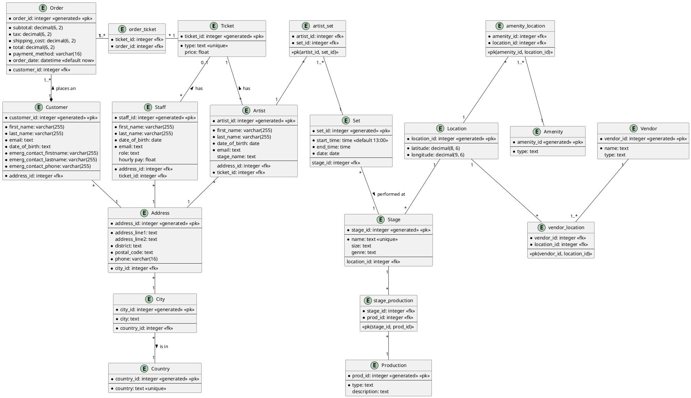

```plantuml
@startuml

entity Ticket {
    * ticket_id: integer <<generated>> <<pk>>
    --
    * type: text <<unique>>
    price: float
}

entity Order {
    * order_id: integer <<generated>> <<pk>>
    --
    * subtotal: decimal(6, 2)
    * tax: decimal(6, 2)
    * shipping_cost: decimal(6, 2)
    * total: decimal(6, 2)
    * payment_method: varchar(16)
    * order_date: datetime <<default now>>
    --
    * customer_id: integer <<fk>>
}

entity order_ticket {
    * ticket_id: integer <<fk>>
    * order_id: integer <<fk>>
    
}

entity Customer {
    * customer_id: integer <<generated>> <<pk>>
    --
    * first_name: varchar(255)
    * last_name: varchar(255)
    * email: text
    * date_of_birth: text
    * emerg_contact_firstname: varchar(255)
    * emerg_contact_lastname: varchar(255)
    * emerg_contact_phone: varchar(255)
    --
    * address_id: integer <<fk>>
}

entity Staff {
    * staff_id: integer <<generated>> <<pk>>
    --
    * first_name: varchar(255)
    * last_name: varchar(255)
    * date_of_birth: date
    * email: text
    role: text
    hourly pay: float
    --
    * address_id: integer <<fk>>
    ticket_id: integer <<fk>>
}

entity Stage {
    * stage_id: integer <<generated>> <<pk>>
    --
    * name: text <<unique>>
    size: text
    genre: text
    --
    location_id: integer <<fk>>
}

entity Vendor {
    * vendor_id: integer <<generated>> <<pk>>
    --
    * name: text
    type: text
}

entity Address {
    * address_id: integer <<generated>> <<pk>>
    --
    * address_line1: text
    address_line2: text
    * district: text
    * postal_code: text
    * phone: varchar(16)
    --
    * city_id: integer <<fk>>
}

entity Country {
    * country_id: integer <<generated>> <<pk>>
    --
    * country: text <<unique>>
}

entity City {
    * city_id: integer <<generated>> <<pk>>
    --
    * city: text
    --
    * country_id: integer <<fk>>
}

entity Location {
    * location_id: integer <<generated>> <<pk>>
    --
    * latitude: decimal(8, 6)
    * longitude: decimal(9, 6)
}

entity Amenity {
    * amenity_id <<generated>> <<pk>>
    --
    * type: text
}

entity amenity_location {
    * amenity_id: integer <<fk>>
    * location_id: integer <<fk>>
    --
    <<pk(amenity_id, location_id)>>
}

entity vendor_location {
    * vendor_id: integer <<fk>>
    * location_id: integer <<fk>>
    --
    <<pk(vendor_id, location_id)>>
}

entity Set {
    * set_id: integer <<generated>> <<pk>>
    --
    * start_time: time <<default 13:00>>
    * end_time: time
    * date: date
    --
    stage_id: integer <<fk>>
}

entity Artist {
    * artist_id: integer <<generated>> <<pk>>
    --
    * first_name: varchar(255)
    * last_name: varchar(255)
    * date_of_birth: date
    * email: text
    stage_name: text
    --
    address_id: integer <<fk>>
    * ticket_id: integer <<fk>>
}

entity artist_set {
    * artist_id: integer <<fk>>
    * set_id: integer <<fk>>
    --
    <<pk(artist_id, set_id)>>
}

entity Production {
    * prod_id: integer <<generated>> <<pk>>
    --
    * type: text
    description: text
}

entity stage_production {
    * stage_id: integer <<fk>>
    * prod_id: integer <<fk>>
    --
    <<pk(stage_id, prod_id)>>
}

Order "1" - "  1..*" order_ticket
order_ticket "*" - "1" Ticket
Order "1..*" --* "1" Customer: < places an
'Order -- "*" Ticket
'Ticket "1..*" -- "1" Customer: buys <
Ticket "1" -- "*" Artist: has <
Ticket "0..1" -- "*" Staff: has <
'Stage "1..*" -- "1..*" Artist: performs at <
Location "1  " -- "*" Stage
'Location "1..*" -- "*" Vendor
'Location "1..*" -- "*" Amenity
Artist "*" -- "1" Address
Staff "*" -- "1" Address
Customer "*" -- "1" Address
Address "*" -- "1" City
City "*" -- "1" Country: is in >
Set "*" -- "1  " Stage: performed at >
'Set "*" -- "*" Artist
artist_set "*" -- "1" Artist
artist_set "1..*" -- "1" Set
Vendor "1  " -- "1..*" vendor_location
Location "  1" -- "*" vendor_location
amenity_location "1..* " -- "1" Amenity
amenity_location "*" -- "1" Location
Stage "1" -- "*" stage_production
stage_production "*" -- "1" Production

@enduml
```